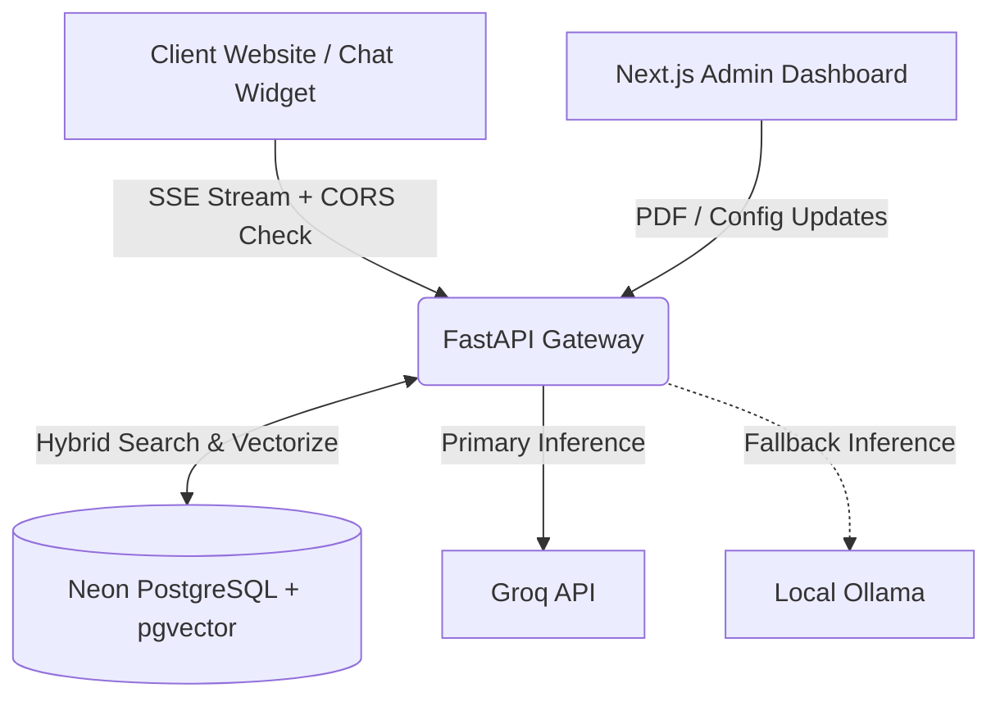

# Relay RAG 🚀


**Relay RAG** is an enterprise-grade, multi-tenant Retrieval-Augmented Generation (RAG) API and Workspace. It allows organizations to ingest private knowledge bases for distinct tenants, securely isolating their data while providing blisteringly fast AI chat interfaces.

---

## 🌟 Key Features

* **True Multi-Tenancy**: Complete data isolation. Vectors and chat logs are strictly partitioned by `X-Tenant-ID`.
* **Hybrid RRF Search**: Combines semantic vector similarity (pgvector HNSW) with keyword search (PostgreSQL TSVECTOR) using Reciprocal Rank Fusion for perfect retrieval accuracy.
* **Auto-Failover AI Engine**: Uses Groq's high-speed Inference API (`openai/gpt-oss-20b`) as the primary brain. If rate limits or network failures occur, it seamlessly fails over to a local Ollama instance (`tinyllama`) with zero downtime.
* **Enterprise Security & Validation**: Protects external backend requests using Bearer token API keys and validates web widget access via strict CORS `allowed_domains` checks.
* **Knowledge Base Tracking**: Allows tracking ingestion on a per-document level, supporting granular PDF source deletion.
* **Dynamic White-Labeled Widget**: A lightweight Vanilla JS/CSS drop-in widget dynamically loads its primary brand colors, bot title, and avatar based on tenant configurations. Support included for Markdown parsing and inline citation rendering via Server-Sent Events (SSE).
* **Rich Telemetry Dashboard**: A Next.js 15 dashboard (built with Tailwind v4 and Recharts) to instantly manage tenants, configure UI behaviors, upload documents, and visualize daily engagement analytics.

---

## 🏗️ Architecture



---

## 🚀 Getting Started

### 1. Database Setup (Neon PostgreSQL)
1. Create a Neon Serverless Postgres database.
2. Enable the pgvector extension.
3. Update the `DATABASE_URL` in `backend/.env`.
4. Run the schema migration:
```bash
cd backend
python setup_db.py
```

### 2. Backend (FastAPI + LangChain)
1. Install Python dependencies:
```bash
cd backend
python -m venv venv
venv\Scripts\activate
pip install -r requirements.txt
```
2. Set your `GROQ_API_KEY` in `backend/.env`.
3. Start the API server:
```bash
uvicorn app.main:app --reload
```

### 3. Admin Dashboard (Next.js)
1. Install dependencies and run the development server:
```bash
cd frontend/admin
npm install
npm install recharts
npm run dev
```
2. Navigate to `http://localhost:3000` to access the Relay Workspace.

### 4. Local AI Fallback (Ollama)
Ensure you have Ollama installed and the tinyllama model pulled for the fallback mechanism to work:
```bash
ollama run tinyllama
```

---

## 💻 Usage

### Ingesting Knowledge
Use the Admin Dashboard to create a tenant, configure their white-labeling interface, and upload PDF documents. The system will automatically chunk the data, generate SentenceTransformer embeddings (`all-MiniLM-L6-v2`), and sync it to pgvector while persisting metadata for source tracking.

### Querying & Integration
Embed the Vanilla JS widget from `frontend/widget/index.html` into your application. Be sure to authorize the exact domain name in the tenant's `allowed_domains` inside the dashboard.
When a user asks a question, the API retrieves the top-K relevant chunks using Hybrid Search, injects them into the LLM context window, and streams the markdown-rich answer back along with document citations.

---

## 🛡️ Security & API Keys
Tenants can be securely managed via the Admin Dashboard. You can instantly generate secure, 32-character API Keys (`relay_...`) for external API authentication, or completely purge a tenant's data footprint via cascading SQL deletes. 

External API connections (server-to-server) must include `Authorization: Bearer <API-Key>`, whereas frontend clients must abide by standard origin access rules.

---
*Designed & Engineered by Rohan Chakraborti.*
