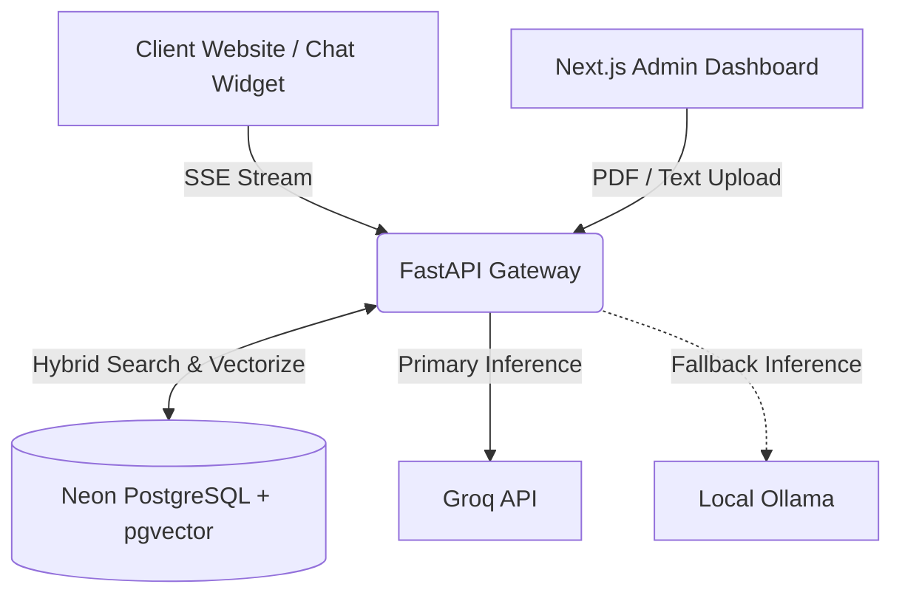

# Relay RAG 🚀


**Relay RAG** is an enterprise-grade, multi-tenant Retrieval-Augmented Generation (RAG) API and Workspace. Built by **Rohan Chakraborti**, it allows organizations to ingest private knowledge bases for distinct tenants, securely isolating their data while providing blisteringly fast AI chat interfaces.

---

## 🌟 Key Features

* **True Multi-Tenancy**: Complete data isolation. Vectors and chat logs are strictly partitioned by `X-Tenant-ID`.
* **Hybrid RRF Search**: Combines semantic vector similarity (pgvector HNSW) with keyword search (PostgreSQL TSVECTOR) using Reciprocal Rank Fusion for perfect retrieval accuracy.
* **Auto-Failover AI Engine**: Uses Groq's high-speed Inference API (`openai/gpt-oss-20b`) as the primary brain. If rate limits or network failures occur, it seamlessly fails over to a local Ollama instance (`tinyllama`) with zero downtime.
* **Server-Sent Events (SSE)**: Streams AI responses back to the client token-by-token for a real-time ChatGPT-like experience.
* **Sleek Admin Workspace**: A Next.js 15 dashboard (built with Tailwind v4) to instantly manage tenants, upload PDF documents, and monitor telemetry.
* **Drop-in Chat Widget**: A lightweight, dependency-free Vanilla JS/CSS widget that can be embedded into any tenant's website.

---

## 🏗️ Architecture



---

## 🚀 Getting Started

### 1. Database Setup (Neon PostgreSQL)
1. Create a Neon Serverless Postgres database.
2. Enable the pgvector extension.
3. Update the `DATABASE_URL` in `backend/.env`.
4. Run the schema migration:
```bash
cd backend
python setup_db.py
```

### 2. Backend (FastAPI + LangChain)
1. Install Python dependencies:
```bash
cd backend
python -m venv venv
venv\Scripts\activate
pip install -r requirements.txt
```
2. Set your `GROQ_API_KEY` in `backend/.env`.
3. Start the API server:
```bash
uvicorn app.main:app --reload
```

### 3. Admin Dashboard (Next.js)
1. Install dependencies and run the development server:
```bash
cd frontend/admin
npm install
npm run dev
```
2. Navigate to `http://localhost:3000` (or `3001` if port is occupied) to access the Relay Workspace.

### 4. Local AI Fallback (Ollama)
Ensure you have Ollama installed and the tinyllama model pulled for the fallback mechanism to work:
```bash
ollama run tinyllama
```

---

## 💻 Usage

### Ingesting Knowledge
Use the Admin Dashboard to create a tenant and upload raw text or PDF documents. The system will automatically chunk the data, generate SentenceTransformer embeddings (`all-MiniLM-L6-v2`), and sync it to pgvector.

### Querying
Embed the Vanilla JS widget from `frontend/widget/index.html` into your application. When a user asks a question, the API retrieves the top-K relevant chunks using Hybrid Search, injects them into the LLM context window, and streams the answer back.

---

## 🛡️ Security & API Keys
Tenants can be securely managed via the Admin Dashboard. You can instantly generate secure, 32-character API Keys (`relay_...`) for external API authentication, or completely purge a tenant's data footprint via cascading SQL deletes.

---
*Designed & Engineered by Rohan Chakraborti.*
